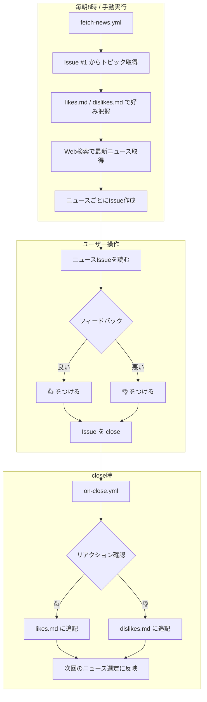

# My News Fetcher

GitHub Actions + Claude Code で毎朝自動でニュースを収集・要約して Issue に投稿するシステム。

## ワークフロー



## 使い方

### トピックの編集

[Issue #1](https://github.com/tachibanayu24/my-neww-fetcher/issues/1) にコメント:

```
@claude ファッションも追加して
```

```
@claude Web Frontend を削除して
```

### ニュースの深堀り

ニュース Issue にコメント:

```
@claude この資金調達について、投資家の詳細を教えて
```

### フィードバック

ニュース Issue に 👍 or 👎 をつけてから close

### 手動実行

Actions → Fetch Daily News → Run workflow
